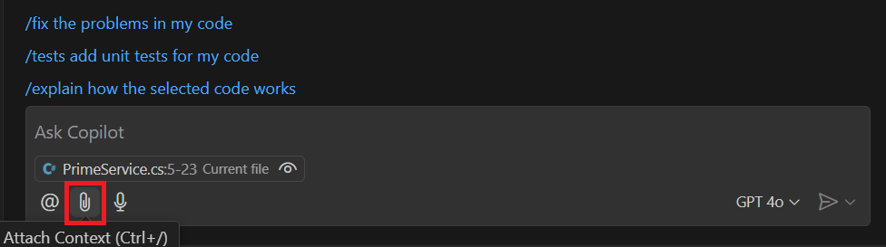
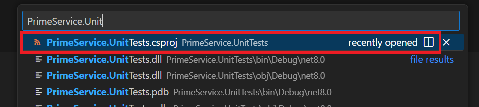
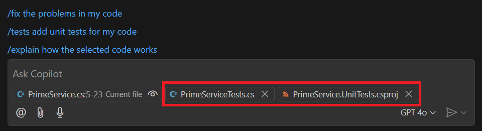
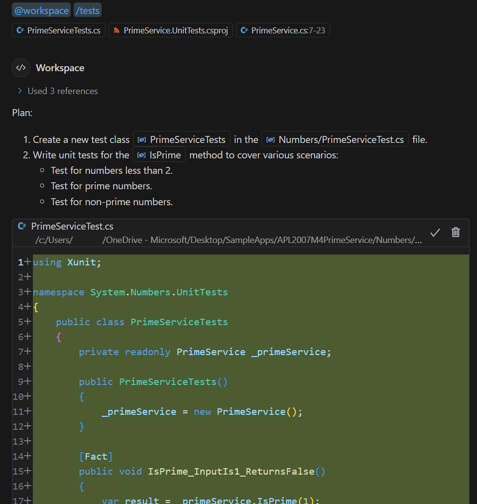
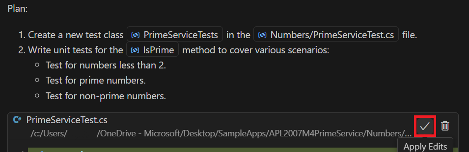
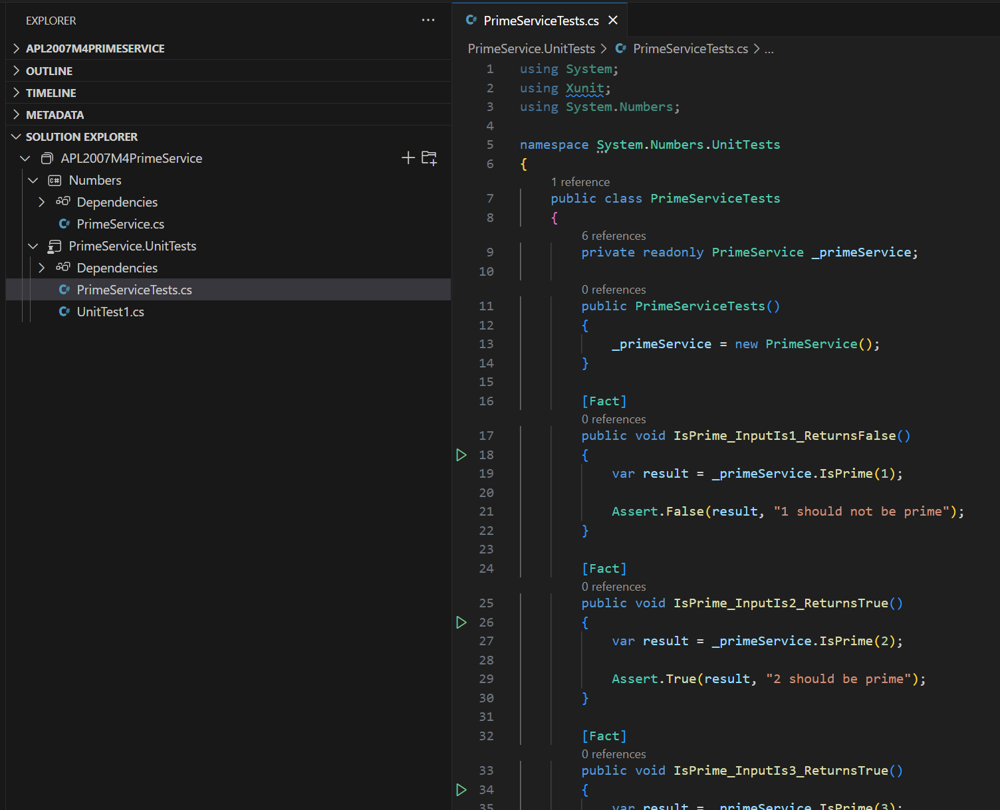
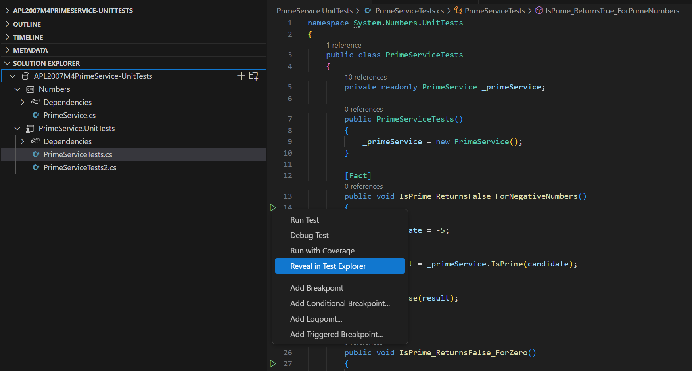
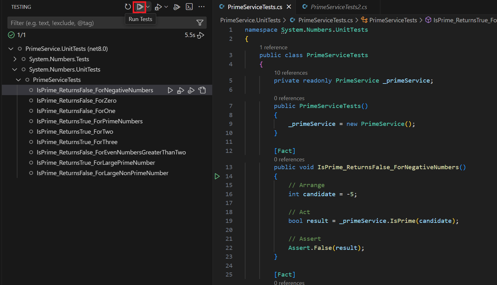

## Create unit tests using Chat view

Use the following steps to complete this section of the exercise:

GitHub Copilot and GitHub Copilot Chat can assist you in creating unit tests by offering suggestions tailored to your codebase’s context. With GitHub Copilot Chat, you can quickly generate unit tests for particular methods or classes in your code.

1. In the **Solution Explorer**, navigate to the **Numbers** folder and open the `PrimeService.cs` file.
2. Select the `IsPrime` method.
3. Open the **Chat** view.
4. Click the **Attach Context** button.

The **Attach Context** button (represented by a paperclip icon) allows GitHub Copilot to identify the relevant portions of your codebase. By adding this context, GitHub Copilot Chat can generate more accurate suggestions. In this case, you’ll use `PrimeServiceTests.cs` as the reference file for creating targeted unit tests.



5. In the **Search attachments** dropdown, head to the **recently opened** section and choose `PrimeServiceTests.cs`.  

6. Click the **Attach Context** button again to confirm your selection.

7. In the **Search attachments** text box, start typing `PrimeService.Unit`. Once it appears, select `PrimeService.UnitTests.csproj`.  
   *By specifying this project file, you’re providing GitHub Copilot with the broader testing context it needs.*



> [!NOTE]
> Alternatively, you can drag a file from the Explorer view directly into the Chat view. This approach often speeds up the process of adding context.

8. Notice that the Chat view is updated with the additional context.



9. In the **Chat view**, select **/tests add unit tests for my code**.  

The `/tests add unit tests for my code` option generates unit tests for the code currently selected in the editor. 

Here, you have chosen the `IsPrime` method in the `PrimeService.cs` file.

10. Take a moment to review GitHub Copilot’s suggestions.  

GitHub Copilot’s suggestion will present two sections: a “Plan” and a code sample of the proposed unit tests. 

The plan specifically recommends creating a new `PrimeServiceTest.cs` file for the unit tests, placing it inside the **Numbers** project folder.



11. In the Chat view, select Apply Edits.



12. Notice that clicking **Apply Edits** adds the generated unit test code into a new tab within your editor.

You can then integrate this code into the `PrimeServiceTests.cs` file found in your `PrimeService.UnitTests` project.

13. From the **File** menu, select **Save As** and navigate to the **PrimeService.UnitTests** folder.
14. Choose `PrimeServiceTests.cs`, then click **Save**.
15. When asked to overwrite the existing file, select **Yes**.

16. Take a moment to review the updated `PrimeServiceTests.cs` file.

The code suggested by GitHub Copilot Chat should now contain unit tests covering both prime and non-prime numbers. You may see parameterized tests that use `[Theory]` and `[InlineData]` attributes to test multiple inputs more efficiently.

The resulting code snippet should look similar to the following:

```csharp
using Xunit;

namespace System.Numbers.UnitTests
{
    public class PrimeServiceTests
    {
        private readonly PrimeService _primeService;

        public PrimeServiceTests()
        {
            _primeService = new PrimeService();
        }

        [Fact]
        public void IsPrime_InputIs1_ReturnsFalse()
        {
            var result = _primeService.IsPrime(1);

            Assert.False(result, "1 should not be prime");
        }

        [Fact]
        public void IsPrime_InputIs2_ReturnsTrue()
        {
            var result = _primeService.IsPrime(2);

            Assert.True(result, "2 should be prime");
        }

        [Fact]
        public void IsPrime_InputIs3_ReturnsTrue()
        {
            var result = _primeService.IsPrime(3);

            Assert.True(result, "3 should be prime");
        }

        [Fact]
        public void IsPrime_InputIs4_ReturnsFalse()
        {
            var result = _primeService.IsPrime(4);

            Assert.False(result, "4 should not be prime");
        }

        [Theory]
        [InlineData(5, true)]
        [InlineData(6, false)]
        [InlineData(7, true)]
        [InlineData(8, false)]
        [InlineData(9, false)]
        [InlineData(10, false)]
        public void IsPrime_Values_ReturnExpectedResult(int value, bool expected)
        {
            var result = _primeService.IsPrime(value);

            Assert.Equal(expected, result);
        }
    }
}
```

17. Rebuild the solution.

You should see green "test arrows" next to each unit test (assuming the build is successful).



You will create additional unit tests in the next section, so there’s no need to run them just yet.

However, when you’re ready to execute your tests, you have several options:

* Run the tests from the Visual Studio Code terminal using the `dotnet test` command.
* Use the Visual Studio Code **Test Explorer** view.
* Open the Visual Studio Code **Command Palette** and choose **Test: Run All Tests**.
* In the Visual Studio Code editor, right-click and select **Run Tests in Current File** from the context menu.

The tests you created during this section should pass without issues. Once they do, the green “test arrows” beside each unit test will turn into green circles with checkmarks, indicating successful test runs.

## Create unit tests using inline chat

Use the following steps to complete this part of the exercise:

1. In the **Solution Explorer**, find and open `PrimeService.cs` (you’ll find it inside the **Numbers** folder).
2. Select the `IsPrime` method.
3. Start an inline chat session and enter the following prompt:

```
Create unit tests for the IsPrime method using the xUnit framework.
```

4. Review the suggestions provided by the inline chat.

```csharp
using Xunit;

namespace System.Numbers.UnitTests
{
    public class PrimeServiceTests
    {
        private readonly PrimeService _primeService;

        public PrimeServiceTests()
        {
            _primeService = new PrimeService();
        }

        [Fact]
        public void IsPrime_InputIs1_ReturnsFalse()
        {
            var result = _primeService.IsPrime(1);

            Assert.False(result, "1 should not be prime");
        }

        [Fact]
        public void IsPrime_InputIs2_ReturnsTrue()
        {
            var result = _primeService.IsPrime(2);

            Assert.True(result, "2 should be prime");
        }

        [Fact]
        public void IsPrime_InputIs3_ReturnsTrue()
        {
            var result = _primeService.IsPrime(3);

            Assert.True(result, "3 should be prime");
        }

        [Fact]
        public void IsPrime_InputIs4_ReturnsFalse()
        {
            var result = _primeService.IsPrime(4);

            Assert.False(result, "4 should not be prime");
        }

        [Theory]
        [InlineData(5, true)]
        [InlineData(6, false)]
        [InlineData(7, true)]
        [InlineData(8, false)]
        [InlineData(9, false)]
        [InlineData(10, false)]
        public void IsPrime_Values_ReturnExpectedResult(int value, bool expected)
        {
            var result = _primeService.IsPrime(value);

            Assert.Equal(expected, result);
        }
    }
}
```

5. Notice that both the Chat view and the inline chat offer similar test coverage.

6. To discard the suggestion from the inline chat, choose **Discard**, then close the file tab that the inline chat created.

Keep in mind that the unit tests suggested by GitHub Copilot may not be comprehensive. We’ll explore more nuanced edge cases later in this workshop.

## Create unit tests using GitHub Copilot code line completion suggestions

You can also produce unit tests by leveraging GitHub Copilot’s autocompletion suggestions. This approach can help you rapidly generate tests for your code.

In this section, you’ll use GitHub Copilot to create unit tests for the `IsPrime` method in the `PrimeService` class.

Use the following steps to complete this portion of the exercise:

1. Open `PrimeServiceTests.cs` in the editor.
2. Remove all existing code from within the `PrimeServiceTests` class.

The contents of the PrimeServiceTests.cs file should resemble the following code snippet:

```
namespace System.Numbers.UnitTests;

public class PrimeServiceTests
{
}
```

3. Save the `PrimeServiceTests.cs` file, and then rebuild the solution.
4. Inside the `PrimeServiceTests` class, insert a blank line.  

After a brief pause, GitHub Copilot will propose an inline completion for the `PrimeServiceTests` class.

5. Select **Accept**, and take a moment to review the unit tests GitHub Copilot generated.
6. Spend some time examining the set of unit tests created for the `IsPrime` method.  

It's okay if the test coverage is incomplete. The next section of the exercise shows you how to use GitHub Copilot Chat to ask GitHub Copilot to suggest additional edge cases that should be tested.


```csharp
namespace System.Numbers.UnitTests
{
    public class PrimeServiceTests
    {
        private readonly PrimeService _primeService;

        public PrimeServiceTests()
        {
            _primeService = new PrimeService();
        }

        [Fact]
        public void IsPrime_ReturnsFalse_ForNegativeNumbers()
        {
            // Arrange
            int candidate = -5;

            // Act
            bool result = _primeService.IsPrime(candidate);

            // Assert
            Assert.False(result);
        }

        [Fact]
        public void IsPrime_ReturnsFalse_ForZero()
        {
            // Arrange
            int candidate = 0;

            // Act
            bool result = _primeService.IsPrime(candidate);

            // Assert
            Assert.False(result);
        }

        [Fact]
        public void IsPrime_ReturnsFalse_ForOne()
        {
            // Arrange
            int candidate = 1;

            // Act
            bool result = _primeService.IsPrime(candidate);

            // Assert
            Assert.False(result);
        }

        [Fact]
        public void IsPrime_ReturnsTrue_ForPrimeNumbers()
        {
            // Arrange
            int candidate = 7;

            // Act
            bool result = _primeService.IsPrime(candidate);

            // Assert
            Assert.True(result);
        }
    }
}
```

## Create unit tests for specific conditions using GitHub Copilot and GitHub Copilot Chat

1. Highlight the entire contents of the `PrimeServiceTests` class.
2. Open the **Chat** view.
3. To include `PrimeService.cs` in the Chat view’s context, simply drag and drop the file from the **Explorer** view into the **Chat** view.

4. In the **Chat** view, enter the following prompt:

```
@workspace #selection are there any edge cases that should also be tested 
```

5. Take a moment to review the suggestions GitHub Copilot provides:

```
Yes, there are a few edge cases that should also be tested:

1. Large Prime Numbers: Ensure the function can handle large prime numbers.

2. Large Non-Prime Numbers: Ensure the function can handle large non-prime numbers.

3. Even Numbers Greater Than 2: Ensure the function returns false for even numbers greater than 2.

4. Small Prime Numbers: Ensure the function correctly identifies small prime numbers like 2 and 3.

Here are the additional test cases:
```

```csharp
[Fact]
public void IsPrime_ReturnsTrue_ForTwo()
{
    // Arrange
    int candidate = 2;

    // Act
    bool result = _primeService.IsPrime(candidate);

    // Assert
    Assert.True(result);
}

[Fact]
public void IsPrime_ReturnsTrue_ForThree()
{
    // Arrange
    int candidate = 3;

    // Act
    bool result = _primeService.IsPrime(candidate);

    // Assert
    Assert.True(result);
}

[Fact]
public void IsPrime_ReturnsFalse_ForEvenNumbersGreaterThanTwo()
{
    // Arrange
    int candidate = 4;

    // Act
    bool result = _primeService.IsPrime(candidate);

    // Assert
    Assert.False(result);
}

[Fact]
public void IsPrime_ReturnsTrue_ForLargePrimeNumber()
{
    // Arrange
    int candidate = 7919;

    // Act
    bool result = _primeService.IsPrime(candidate);

    // Assert
    Assert.True(result);
}

[Fact]
public void IsPrime_ReturnsFalse_ForLargeNonPrimeNumber()
{
    // Arrange
    int candidate = 8000;

    // Act
    bool result = _primeService.IsPrime(candidate);

    // Assert
    Assert.False(result);
}
```

6. Add a blank line after the final test method in the `PrimeServiceTests` class.

7. In the **Chat** view, hover over the code snippet and select **Insert at Cursor**.

8. Save the `PrimeServiceTests.cs` file, then rebuild the solution.

9. Review the newly generated unit tests for the `IsPrime` method.  

Make sure the tests are meaningful, valid, and cover the intended edge cases. Once you’re confident in them, you can run the tests to verify their results.

10. Hover your mouse pointer over one of the green "test arrows."  

You’ll see a tooltip explaining that you can click to run the test or right-click for more options.

11. Right-click on a green "test arrow."


12. Choose **Reveal in Test Explorer**.  
The **Test Explorer** view will open, allowing you to run, debug, and review test results. If you need to open it manually, select **Testing** from the Activity Bar on the left side of Visual Studio Code. Look for the icon that resembles a lab flask.

13. At the top of the **Test Explorer** view, click **Run Tests**.


After a brief pause, the **Test Explorer** will display the outcome of the test run. All tests should pass successfully. You’ll see green checkmarks both in the **Test Explorer** and next to the unit tests in the editor, confirming that the tests have completed and passed without issues.

## Summary
During this exercise, you leveraged GitHub Copilot Chat within Visual Studio Code to create and refine unit tests for a project. You began by generating tests for the IsPrime method in the PrimeService class, using both the Chat view and inline chat prompts. After that, you worked with GitHub Copilot and GitHub Copilot Chat to introduce tests covering specific conditions and input parameters, relying on code line completions to ensure the validity of function inputs. Additionally, you used the Chat view to request suggestions for testing edge cases that might otherwise go overlooked.

Once you had reviewed the suggestions from GitHub Copilot, you ran the tests to confirm they passed successfully. Finally, you explored how to run tests and examine their outcomes using the Test Explorer in Visual Studio Code, gaining valuable insights into managing test runs and verifying results.
